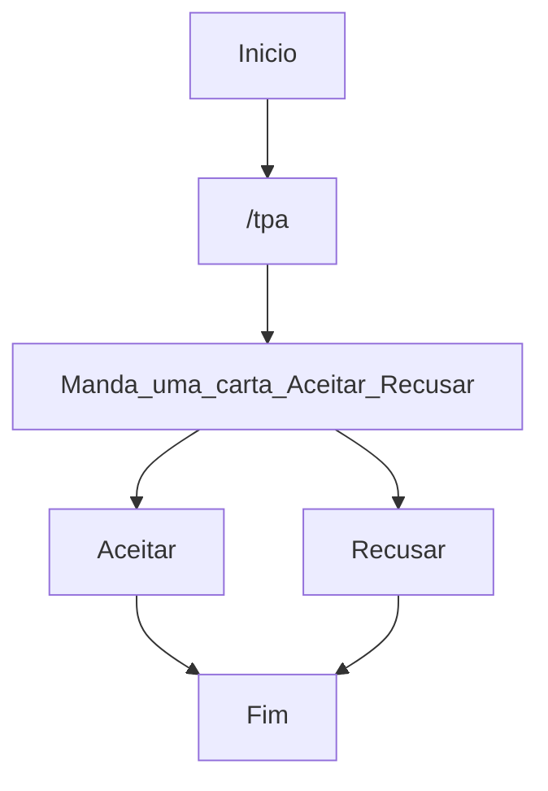

# Tpa Minecraft 1.21.4

Tpa posibilita teleportar ao jogador amigo mandando

solicitacao Aceitar ou recuzar

Support EN e BR comfiguravel

Support enable & disable Plugin

Comando: /tpa <name>

```mermaid
graph TD;
    Inicio-->/tpa;
    /tpa-->Manda_uma_carta_Aceitar_Recusar;
    Manda_uma_carta_Aceitar_Recusar-->Aceitar;
    Manda_uma_carta_Aceitar_Recusar-->Recusar;

    Aceitar-->Fim;
    Recusar-->Fim;
```

