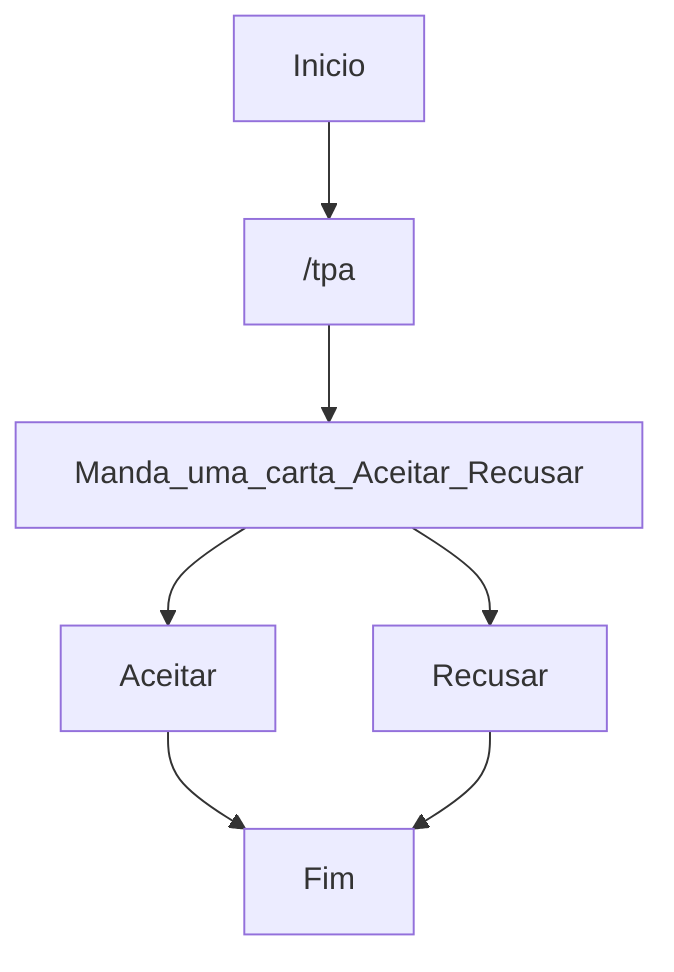

# Tpa Minecraft 1.21.4
The Tpa plugin allows players to teleport to a friend by sending a request. The recipient can choose to accept or decline the teleportation request.
Language Support:
Supported languages: BR, EN, ES, FR, DE, RU, ZH, ZH-TW, JA, KO, IT, NL, PL, SV, CS, HU, TR, AR, FI, DA.
# Plugin Features:
✅ Enable & Disable Support – Easily activate or deactivate the plugin as needed.
✅ Smooth Teleportation – Seamlessly teleport to friends upon request approval.
✅ Quick Commands – Simple and efficient teleport system for multiplayer servers.
Available Command:
- /tpa – Send a teleport request to another player.
This plugin improves multiplayer interaction, making travel across the Minecraft world easier and more fun! 🚀
Let me know if you’d like any refinements! 😊

